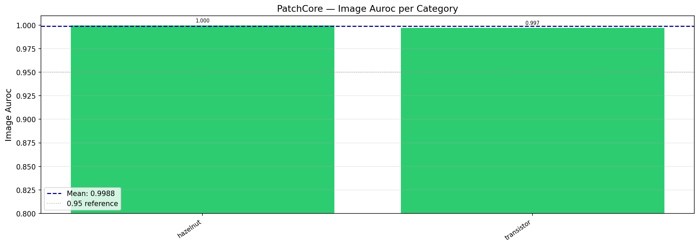
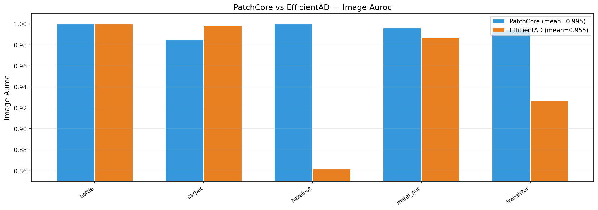
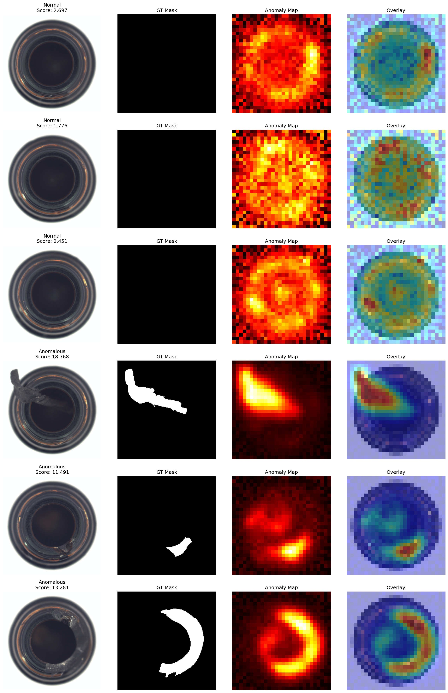

# Industrial Anomaly Detection — MVTec AD

Unsupervised anomaly detection on the MVTec Anomaly Detection benchmark using PatchCore and EfficientAD.

## Results

### PatchCore (WideResNet50 backbone)

| Category     | Image AUROC | Pixel AUROC |
|---|---|---|
| bottle       | 1.0000      | 0.9856      |
| cable        | 0.9859      | 0.9848      |
| capsule      | 0.9916      | 0.9900      |
| carpet       | 0.9852      | 0.9907      |
| grid         | 0.9900      | 0.9820      |
| hazelnut     | 1.0000      | 0.9883      |
| leather      | 1.0000      | 0.9922      |
| metal_nut    | 0.9961      | 0.9868      |
| pill         | 0.9471      | 0.9817      |
| screw        | 0.9672      | 0.9892      |
| tile         | 1.0000      | 0.9553      |
| toothbrush   | 0.9167      | 0.9888      |
| transistor   | 0.9942      | 0.9735      |
| wood         | 0.9868      | 0.9318      |
| zipper       | 0.9751      | 0.9815      |
| **MEAN**     | **0.9824**  | **0.9801**  |



### PatchCore vs EfficientAD (5 categories)

| Category | Image AUROC | Pixel AUROC | 
|---|---|---|
| bottle | 1.000 | 0.976 | 
| carpet | 0.998 | 0.958 | 
| hazelnut | 0.862 | 0.849 | 
| metal_nut | 0.987 | 0.960 | 
| transistor | 0.927 | 0.925 | 
| **MEAN** | **0.955** | **0.934** |



### Anomaly Maps (Visual Localization)
Below is an example of anomaly localization results on the `bottle` category using PatchCore, showing the original image, generated anomaly heatmap, and the visual overlay:



---

## Method

### PatchCore
Extracts locally aware patch features from a frozen WideResNet50 backbone (layers 2+3),
subsamples a representative coreset via greedy approximation, and detects anomalies
via k-NN distance to the nearest normal patch in the memory bank.

**Key design choices:**
- Pretrained features generalize well to industrial textures without fine-tuning
- Coreset subsampling keeps memory bank tractable (~10% of patches)
- No training on defective samples required

### EfficientAD
Knowledge distillation-based method with a student-teacher architecture.
Significantly faster inference than PatchCore with competitive accuracy.

---

## Project Structure

```
mvtec_anomaly_detection/
├── data/
│   └── mvtec/              ← Download dataset here
├── notebooks/
│   ├── 01_dataset_exploration.ipynb
│   └── 02_patchcore_baseline.ipynb
├── src/
│   ├── data/
│   │   └── mvtec_dataset.py        ← Dataset loader
│   ├── models/
│   │   └── patchcore.py            ← Custom PatchCore implementation
│   ├── evaluation/
│   │   ├── metrics.py              ← AUROC, PRO score
│   │   └── failure_analysis.py     ← FP/FN analysis
│   ├── visualization/
│   │   └── visualize.py            ← Anomaly maps, bar charts, ROC curves
│   └── utils/
│       └── mlflow_utils.py         ← Experiment tracking
├── scripts/
│   ├── run_patchcore.py            ← Full 15-category baseline run
│   └── run_efficientad.py          ← EfficientAD comparison
├── configs/
│   ├── patchcore.yaml
│   └── efficientad.yaml
└── results/
    ├── patchcore/
    ├── efficientad/
    └── comparisons/
```

---

## Setup

```bash
# 1. Create and activate environment
python -m venv venv
venv\Scripts\activate        # Windows
# source venv/bin/activate   # Linux/Mac

# 2. Install PyTorch with CUDA (RTX 4050 — CUDA 12.x)
pip install torch torchvision --index-url https://download.pytorch.org/whl/cu121

# 3. Install remaining dependencies
pip install -r requirements.txt

# 4. Download MVTec AD dataset
# https://www.mvtec.com/company/research/datasets/mvtec-ad
# Extract to data/mvtec/

# 5. Validate dataset structure
python -c "from src.data.mvtec_dataset import validate_mvtec_structure; validate_mvtec_structure('data/mvtec')"
```

---

## Usage

```bash
# Run PatchCore baseline (anomalib, all 15 categories)
python scripts/run_patchcore.py --config configs/patchcore.yaml

# Run on specific categories only
python scripts/run_patchcore.py --categories bottle carpet hazelnut

# Run custom PatchCore implementation
python scripts/run_patchcore.py --custom

# Run EfficientAD comparison
python scripts/run_efficientad.py --config configs/efficientad.yaml

# View MLflow experiment dashboard
mlflow ui --backend-store-uri sqlite:///mlflow.db
# Open http://localhost:5000
```

---

## Key Findings

**Failure case analysis:**
- **False positives driven by:** Minor alignment/rotation variations in rigid objects (e.g., pills, screws) and natural variation in organic textures (e.g., wood grain, tile patterns) that lead to high nearest-neighbor distances in the PatchCore memory bank.
- **Hardest categories:** `toothbrush` (Image AUROC: 0.9167) and `pill` (Image AUROC: 0.9471) due to subtle anomalies (like tiny scratches) and low sample counts.
- **Performance gap between object vs. texture categories:** PatchCore performs exceptionally well on both, but textures like `wood` and `tile` exhibit slightly lower Pixel AUROC (0.9318 and 0.9553) due to diffuse boundaries of anomalous regions.

**PatchCore vs EfficientAD (5 categories comparison):**
- **Accuracy:** PatchCore achieves a higher average Image AUROC (**0.9951** vs **0.9548**) on the 5-category subset, outperforming EfficientAD significantly on objects like `hazelnut` (1.0000 vs 0.8618) and `transistor` (0.9942 vs 0.9271).
- **Speed:** EfficientAD has a slow training phase (~1.5–3 hours for 10,000 steps) but delivers extremely fast edge inference (millisecond-level latency, 100+ FPS) since it avoids k-NN searches. PatchCore has zero training time (only coreset generation) but slower inference due to the nearest-neighbor search.
- **When to use which:** Use **PatchCore** when highest accuracy on object categories is required and coreset sizes are small. Use **EfficientAD** for real-time edge deployments with strict latency and memory limits, especially on texture datasets.

---

## References

- Roth et al., "Towards Total Recall in Industrial Anomaly Detection" (CVPR 2022)
- Batzner et al., "EfficientAD: Accurate Visual Anomaly Detection at Millisecond-Level Latencies" (WACV 2024)
- Bergmann et al., "The MVTec Anomaly Detection Dataset" (CVPR 2019)
